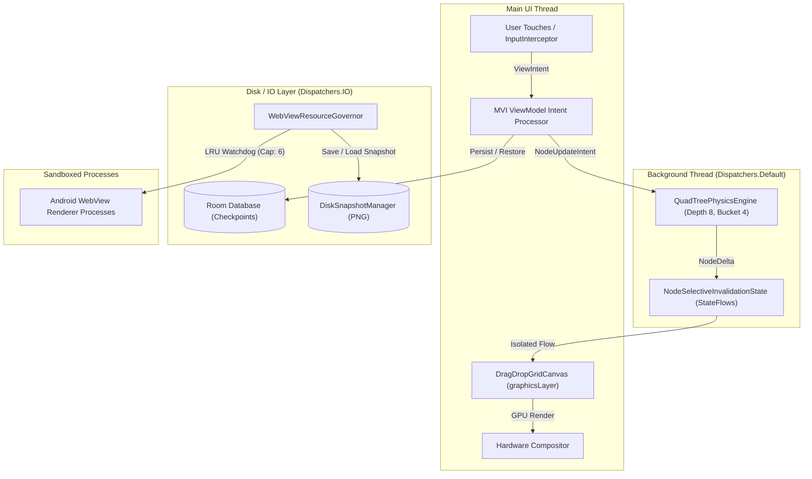

# Crescent Deck — Hardened MVI Spatial Compositor Blueprint

> **Document Class:** Hardened Engineering Architecture Blueprint  
> **Version:** 2.1.0 — Production Specification  
> **Architecture Pattern:** Model-View-Intent (MVI) + Spatial Compositor + Thread Isolation  
> **Target Platform:** Android (API 28+), Kotlin 1.9+, Jetpack Compose, Room 2.6+, Hilt, Media3  

---

## 1. Executive Architecture Summary

Crescent Deck is a high-performance spatial computing environment for Android that manages infinite canvas multitasking, heavy `WebView` render processes, and 60+ FPS physics dynamics on mobile hardware without encountering Android Low Memory Killer (LMK) eviction.



---

## 2. Thread Isolation Matrix & Performance Budgets

| Execution Realm | Execution Context | Allowed Responsibilities | Performance Budget |
| :--- | :--- | :--- | :--- |
| **UI Main Thread** | `Dispatchers.Main` | Compose recomposition, `Modifier.graphicsLayer` hardware calls, Input hit-testing | $\le 16\text{ms}$ frame time ($60\text{ FPS}$) |
| **Physics Computation** | `Dispatchers.Default` | QuadTree traversal, AABB collision detection, spring dynamics, Euler integration | $\le 8\text{ms}$ per tick |
| **Persistence & IO** | `Dispatchers.IO` | Room SQLite transactions, disk snapshot writing/reading, JSON recovery serialization | Asynchronous non-blocking |
| **WebView Processes** | Isolated OS Renderer | Web page DOM rendering, JS V8 execution, media decoding | Max $150\text{MB}$ RAM per active process |

---

## 3. Core Subsystems Specification

### A. Model-View-Intent (MVI) Intent Dispatcher
All spatial modifications are channeled through an immutable sealed hierarchy:

```kotlin
sealed class ViewIntent {
    data class DragStart(val nodeId: String) : ViewIntent()
    data class UpdatePosition(val nodeId: String, val deltaX: Float, val deltaY: Float) : ViewIntent()
    data class DragEnd(val nodeId: String) : ViewIntent()
    data class ResizeStart(val nodeId: String) : ViewIntent()
    data class UpdateSize(val nodeId: String, val newWidth: Float, val newHeight: Float) : ViewIntent()
    data class ResizeEnd(val nodeId: String) : ViewIntent()
    data class ToggleImmersive(val nodeId: String) : ViewIntent()
    data class MinimizeNode(val nodeId: String) : ViewIntent()
    data class RestoreNode(val nodeId: String) : ViewIntent()
    data class AddNodeFromUri(val uri: String) : ViewIntent()
    data class RemoveNode(val nodeId: String) : ViewIntent()
    data class PanViewport(val deltaX: Float, val deltaY: Float) : ViewIntent()
    data class ZoomViewport(val zoomFactor: Float) : ViewIntent()
}
```

### B. QuadTree Spatial Engine Hardening
* **Max Depth:** $8$ (supports fine spatial granularity up to $256$ cards).
* **Threshold / Bucket Size:** $4$ nodes before quadrant subdivision.
* **Broad-Phase Search:** QuadTree bounding box intersection test ($O(\log N)$).
* **Narrow-Phase Resolution:** Axis-Aligned Bounding Box (AABB) with dynamic gutters:
  * Static gutter: $16\text{dp}$.
  * Active drag gutter: $24\text{dp}$ (magnetic repulsion).
* **Object Allocation Minimization:** Reuses cached `Vector2D` impulse structs during high-frequency ticks to avoid GC pauses.

### C. WebView Resource Governor & Disk-Backed Snapshot Caching
* **Active Node Thresholds:**
  * **GREEN ($< 6$ nodes):** All WebViews active and attached.
  * **YELLOW ($6 - 8$ nodes):** Least Recently Used (LRU) algorithm kicks in, transitioning the oldest `GRID_FLOW` cards to `MINIMIZED`.
  * **RED (System Low Memory):** Immediate aggressive hibernation of all background cards.
* **DiskSnapshotManager:**
  * When a card is minimized or hibernated, its visible surface is captured to `Bitmap` and compressed to disk (`cacheDir/snapshots/{cardId}.png`).
  * On wake, the bitmap is read asynchronously from disk with the "Cold Start Veil" shimmer until the native WebView is ready.

### D. Hardened WebView Security & Navigation Interception
* **Security Flags:**
  * `domStorageEnabled = true` (essential for web apps).
  * `databaseEnabled = true`.
  * `setWebContentsDebuggingEnabled(false)` in release builds.
* **Navigation Interception:** Custom `WebViewClient.shouldOverrideUrlLoading` intercepts page links. Clicking external links spawns a **new card node** on the Crescent Deck canvas rather than breaking out to the system browser!

---

## 4. Phased Implementation Roadmap

1. **Phase 1: MVI Subsystem & ViewState Store** — Create `ViewIntent`, `DeckViewState`, and integrate `processIntent` into `DeckViewModel`.
2. **Phase 2: QuadTree Hardening & Memory Allocation** — Update `QuadTreePartition` to depth $8$, threshold $4$, and cache vectors.
3. **Phase 3: Real Disk Snapshot Manager** — Implement `DiskSnapshotManager` to write/read actual PNG snapshots to device cache storage.
4. **Phase 4: Hardened WebView Client & Link Interception** — Implement `CrescentWebViewClient` in `LiveCardFrame` with `databaseEnabled`, link-to-node spawning, and `QuadTreeLayoutNormalizer`.
5. **Phase 5: CrashRecoveryManager Debounce & Verification** — Verify 500ms debouncing, Room DB checkpoints, and execute formal test suite.
