# Polymath Deck — Hybrid Architecture Blueprint v2.0

> **Document Class:** System Architecture & Implementation Blueprint  
> **Version:** 2.0.0 — **Full Feature Expansion**  
> **Date:** 2026-10-04  
> **Architecture Style:** MVVM + Unidirectional Data Flow + Physics-Driven GPU Render + Media Pipeline + Feed Aggregator  
> **Platform:** Android (API 28+), Kotlin, Jetpack Compose, Room, Hilt, Media3/ExoPlayer  

---

## 1. Executive Summary

Polymath Deck is a **media-rich browser/aggregator platform** rendered on a physics-driven card canvas. Version 1.0 of this blueprint covered only the rendering engine. This v2.0 expansion integrates the full product surface:

- **Physics Canvas** — QuadTree spatial partitioning, spring dynamics, GPU-accelerated Compose rendering (unchanged from v1)
- **PiP Popup Player** — Draggable floating video overlay with physics-aware docking
- **Tab System** — Browser-style tab management where each tab is a deck
- **Background Playback** — Foreground service with MediaSession, audio focus, lock-screen controls
- **Video/Movie Engine** — Media3/ExoPlayer with adaptive streaming, codec selection, subtitle rendering
- **Notifications** — Channelized alerts for media transport, RSS updates, and system events
- **RSS Feed Grabber** — Feed parser, WorkManager-scheduled refresh, article-to-card materialization
- **Content Router** — URI resolver that maps URLs/feeds/media to the correct card type

---

## 2. Expanded System Architecture — 6-Tier Overview

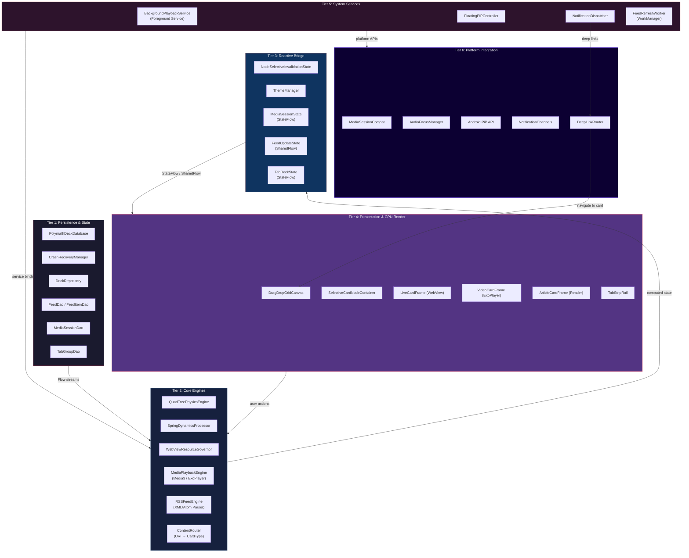

---

## 3. New Module Specifications

### 3.1 Picture-in-Picture (PiP) Popup Player

#### 3.1.1 Architecture

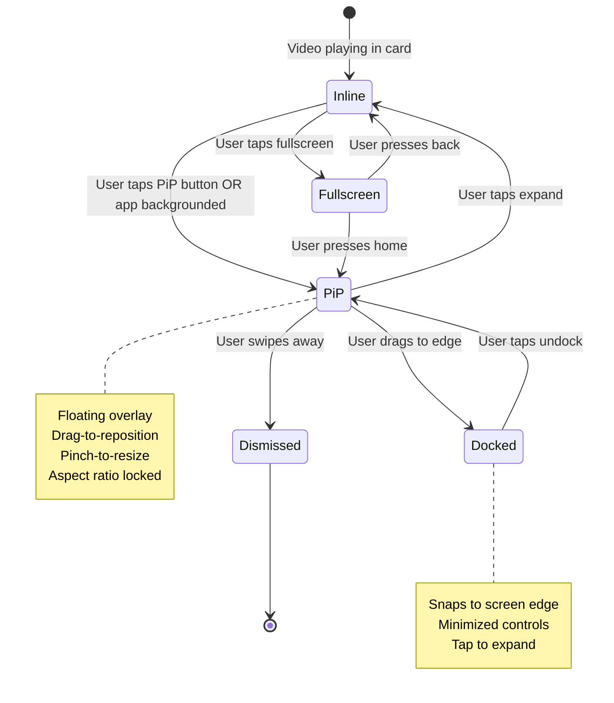

**FloatingPiPController — Key Design Decisions:**

| Decision | Approach | Rationale |
|---|---|---|
| PiP API | Android `PictureInPictureParams` (API 26+) | Native OS-level overlay — no `SYSTEM_ALERT_WINDOW` permission needed. Auto-handles multi-window. |
| Player surface | `SurfaceView` inside PiP Activity | `SurfaceView` has dedicated hardware compositor layer. `TextureView` wastes a GPU texture copy. |
| Aspect ratio | Locked to source video via `Rational(width, height)` | Prevents letterboxing. Recalculated on stream quality change. |
| Controls in PiP | `RemoteAction` icons (play/pause, skip, close) | Android PiP only allows `RemoteAction` — no custom Compose UI inside PiP window. |
| Physics integration | PiP window position fed into QuadTree as a `FixedObstacleNode` | Cards avoid overlapping with the PiP window via collision repulsion. When PiP moves, the obstacle node updates and neighboring cards push away. |

**Transition Flow — Inline → PiP:**

```kotlin
// In VideoCardFrame or Fullscreen Activity
fun enterPiP(player: ExoPlayer, videoSize: VideoSize) {
    val params = PictureInPictureParams.Builder()
        .setAspectRatio(Rational(videoSize.width, videoSize.height))
        .setActions(listOf(
            createRemoteAction(ACTION_PLAY_PAUSE, R.drawable.ic_pause),
            createRemoteAction(ACTION_SKIP_NEXT, R.drawable.ic_skip),
            createRemoteAction(ACTION_CLOSE, R.drawable.ic_close)
        ))
        .setAutoEnterEnabled(true)  // API 31+ auto-PiP on home press
        .build()
    
    activity.enterPictureInPictureMode(params)
}
```

> [!IMPORTANT]
> On API < 31, `setAutoEnterEnabled` is unavailable. The app must detect `onUserLeaveHint()` in the Activity and manually trigger `enterPictureInPictureMode()` before `onPause()` completes, or the player surface will be destroyed.

---

### 3.2 Tab System (TabDeckManager)

#### 3.2.1 Data Model

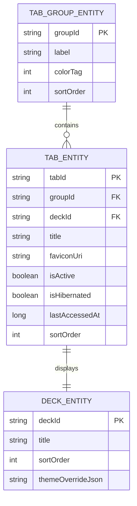

#### 3.2.2 Tab Strip as Physics-Scrollable Rail

The tab strip is **not** a static `LazyRow`. It is a horizontal card rail rendered by the same physics engine:

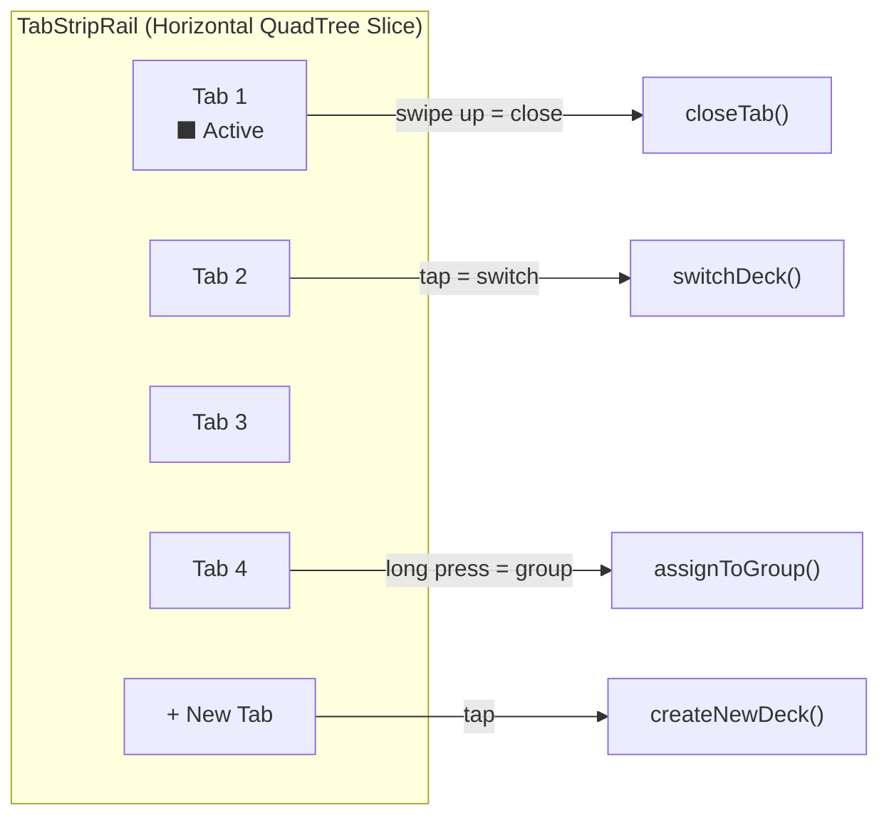

**Gestures:**

| Gesture | Action |
|---|---|
| Tap | Switch to that tab's deck (loads its card grid into `DragDropGridCanvas`) |
| Swipe up/away | Close tab — triggers `WebViewResourceGovernor.hibernate()` for all cards in that deck |
| Long press + drag onto another tab | Create/merge tab group |
| Horizontal fling | Scroll tab strip with spring physics (reuses `SpringDynamicsProcessor`) |
| Pinch on tab strip | Toggle between compact (favicon only) and expanded (favicon + title) mode |

**Tab Hibernation:**
Tabs share the `WebViewResourceGovernor`. When a tab is not active, all its WebView-based cards are moved to `Hibernated` state. Switching back restores from snapshot or reloads.

> [!TIP]
> Tab switching should preemptively warm the target deck's QuadTree 1 frame before the visual transition begins. Use `Dispatchers.Default` to rebuild the spatial index from Room data while the tab-switch animation plays.

---

### 3.3 Background Playback Service

#### 3.3.1 Service Architecture

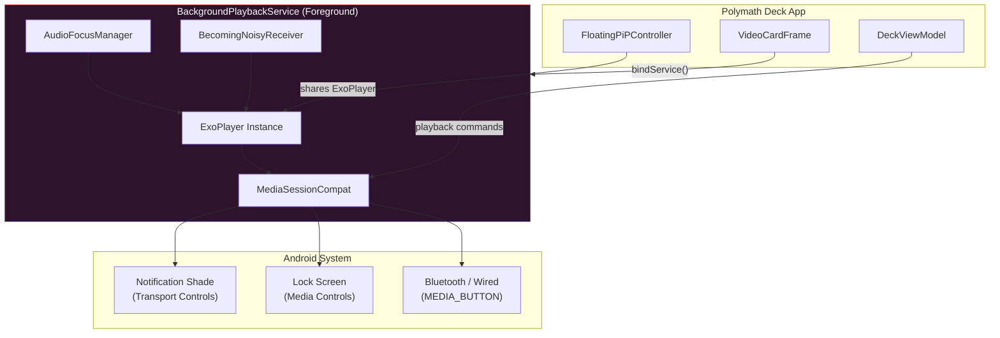

**Audio Focus Contract:**

| Focus State | ExoPlayer Action |
|---|---|
| `AUDIOFOCUS_GAIN` | Resume playback, restore volume |
| `AUDIOFOCUS_LOSS` | Pause permanently, release focus |
| `AUDIOFOCUS_LOSS_TRANSIENT` | Pause, auto-resume when regained |
| `AUDIOFOCUS_LOSS_TRANSIENT_CAN_DUCK` | Lower volume to 20%, keep playing |

**Becoming Noisy (headphones unplugged):**

```kotlin
class BecomingNoisyReceiver(
    private val player: ExoPlayer
) : BroadcastReceiver() {
    override fun onReceive(context: Context, intent: Intent) {
        if (intent.action == AudioManager.ACTION_AUDIO_BECOMING_NOISY) {
            player.pause()  // Never blast audio through speakers unexpectedly
        }
    }
}
```

**Service Lifecycle:**

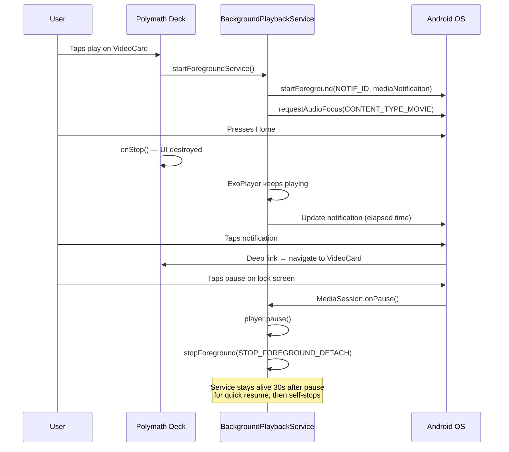

> [!WARNING]
> On Android 12+, foreground service launch from background is **restricted**. The service must be started while the app is visible, or use an exact alarm / `WorkManager` expedited work as a trampoline. Never call `startForegroundService()` from a `BroadcastReceiver` cold path.

---

### 3.4 Movies & Video Playback Engine (MediaPlaybackEngine)

#### 3.4.1 Media3 / ExoPlayer Integration

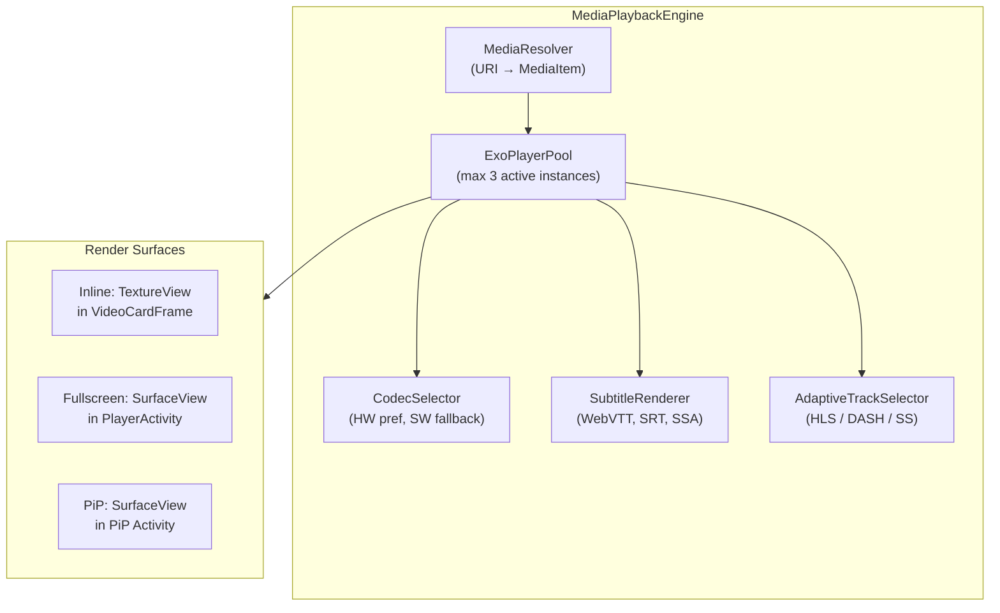

**ExoPlayer Pool:**

Only **3 ExoPlayer instances** are ever alive simultaneously to control memory:

| Slot | Purpose | Surface |
|---|---|---|
| Primary | Currently playing / focused video card | Inline `TextureView` or Fullscreen `SurfaceView` |
| Secondary | Next-up preload (adjacent card in viewport) | No surface — decode-only for instant switch |
| PiP | Detached PiP playback | PiP `SurfaceView` |

When a 4th video is requested, the **oldest non-playing** slot is released.

**Supported Formats & Codec Selection:**

| Format | Container | Codec Preference |
|---|---|---|
| H.264/AVC | MP4, MKV, HLS (.m3u8) | Hardware `OMX.*.avc.dec` → SW `c2.android.avc.decoder` |
| H.265/HEVC | MP4, MKV, DASH (.mpd) | Hardware `OMX.*.hevc.dec` → SW fallback |
| VP9 | WebM, DASH | Hardware if available → SW `c2.android.vp9.decoder` |
| AV1 | MP4, WebM | Hardware (API 34+) → SW `libgav1` |
| Audio-only | MP3, AAC, FLAC, OGG | Always hardware decode |

**Seamless Surface Transition — Inline → Fullscreen → PiP:**

```kotlin
// Single ExoPlayer instance, surface handoff without seek
fun transitionToFullscreen(player: ExoPlayer) {
    // 1. Detach from inline TextureView
    player.clearVideoTextureView(inlineTextureView)
    
    // 2. Launch fullscreen activity (already has SurfaceView)
    // 3. Attach to fullscreen SurfaceView — no buffering, no seek
    player.setVideoSurfaceView(fullscreenSurfaceView)
    
    // Position is preserved. Zero-gap transition.
}
```

**Playback Speed Control:** Exposed via `player.setPlaybackParameters(PlaybackParameters(speed, pitch))`. UI provides 0.5×, 0.75×, 1.0×, 1.25×, 1.5×, 2.0× with pitch correction.

**Subtitle Rendering:** Media3's `SubtitleView` overlays the player surface. For WebVTT, CSS styling is honored. For SRT, a default bottom-center white-on-black style is applied, user-customizable via `ThemeManager`.

---

### 3.5 Notification System (NotificationDispatcher)

#### 3.5.1 Channel Architecture

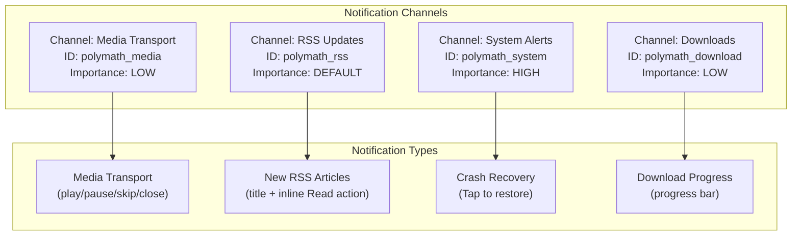

**Media Transport Notification (required for foreground service):**

```kotlin
fun buildMediaNotification(session: MediaSessionCompat): Notification {
    val mediaStyle = MediaStyle()
        .setMediaSession(session.sessionToken)
        .setShowActionsInCompactView(0, 1, 2)  // prev, play/pause, next

    return NotificationCompat.Builder(context, CHANNEL_MEDIA)
        .setSmallIcon(R.drawable.ic_polymath)
        .setContentTitle(currentTrack.title)
        .setContentText(currentTrack.source)
        .setLargeIcon(currentTrack.thumbnail)
        .setStyle(mediaStyle)
        .addAction(R.drawable.ic_prev, "Previous", prevPendingIntent)
        .addAction(playPauseIcon, playPauseLabel, playPausePendingIntent)
        .addAction(R.drawable.ic_next, "Next", nextPendingIntent)
        .addAction(R.drawable.ic_close, "Close", closePendingIntent)
        .setContentIntent(deepLinkPendingIntent)  // tapping opens the card
        .setDeleteIntent(stopServicePendingIntent)
        .setOngoing(isPlaying)  // dismissible when paused
        .build()
}
```

**RSS Notification with Inline Actions:**

```kotlin
fun buildRSSNotification(feedItem: FeedItemEntity): Notification {
    return NotificationCompat.Builder(context, CHANNEL_RSS)
        .setSmallIcon(R.drawable.ic_rss)
        .setContentTitle(feedItem.title)
        .setContentText(feedItem.feedName)
        .setAutoCancel(true)
        .addAction(R.drawable.ic_read, "Read", openCardPendingIntent(feedItem.cardId))
        .addAction(R.drawable.ic_dismiss, "Mark Read", markReadPendingIntent(feedItem.id))
        .setGroup(GROUP_RSS)
        .build()
}
// Summary notification groups multiple RSS alerts
```

**Deep Link Routing:**

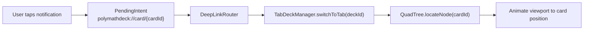

> [!NOTE]
> All `PendingIntent` instances must use `PendingIntent.FLAG_IMMUTABLE` (required on API 31+). For actions that carry mutable data (e.g., `cardId`), use `FLAG_MUTABLE` only when strictly necessary and document the security rationale.

---

### 3.6 RSS Feed Grabber (RSSFeedEngine)

#### 3.6.1 Architecture

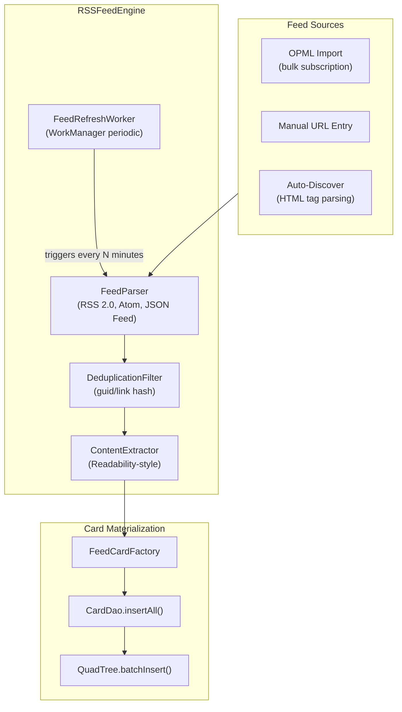

#### 3.6.2 Data Model

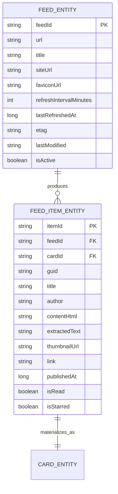

**Feed Refresh Strategy (WorkManager):**

```kotlin
class FeedRefreshWorker(
    context: Context,
    params: WorkerParameters,
    private val feedEngine: RSSFeedEngine,
    private val notifDispatcher: NotificationDispatcher
) : CoroutineWorker(context, params) {

    override suspend fun doWork(): Result {
        val feeds = feedEngine.getActiveFeeds()

        for (feed in feeds) {  // Sequential — no Promise.all / parallel
            try {
                val newItems = feedEngine.refreshFeed(
                    feed,
                    etag = feed.etag,           // Conditional GET
                    lastModified = feed.lastModified  // 304 = skip
                )

                if (newItems.isNotEmpty()) {
                    feedEngine.materializeAsCards(feed, newItems)
                    notifDispatcher.notifyNewArticles(feed, newItems)
                }
            } catch (e: Exception) {
                // Log, skip this feed, continue others
            }
        }
        return Result.success()
    }
}

// Registration — periodic with constraints
WorkManager.getInstance(context).enqueueUniquePeriodicWork(
    "feed_refresh",
    ExistingPeriodicWorkPolicy.KEEP,
    PeriodicWorkRequestBuilder<FeedRefreshWorker>(
        repeatInterval = 30, TimeUnit.MINUTES
    )
    .setConstraints(Constraints.Builder()
        .setRequiredNetworkType(NetworkType.CONNECTED)
        .setRequiresBatteryNotLow(true)
        .build()
    )
    .build()
)
```

**Feed-to-Card Materialization:**

Each new RSS article becomes a `CardEntity` on a dedicated RSS deck:

| Feed Item Field | Card Entity Field | Notes |
|---|---|---|
| `title` | `contentPayload.title` | Displayed as card header |
| `extractedText` | `contentPayload.body` | Readability-cleaned article text |
| `thumbnailUrl` | `contentPayload.heroImage` | Displayed as card thumbnail |
| `link` | `contentPayload.sourceUrl` | Tap to open in `LiveCardFrame` WebView |
| `publishedAt` | `anchorY` sort key | Newest articles positioned at top of deck |

**OPML Import/Export:**

```kotlin
// Import: parse OPML XML → list of feed URLs → bulk subscribe
fun importOPML(inputStream: InputStream): List<FeedEntity>
// Export: query all FeedEntity → generate OPML XML
fun exportOPML(outputStream: OutputStream)
```

> [!TIP]
> Use HTTP conditional requests (`If-None-Match` / `If-Modified-Since`) to avoid downloading unchanged feeds. This reduces bandwidth by 60-80% on typical feed refresh cycles.

---

### 3.7 Content Router (URI → Card Type Resolution)

The Content Router is a unified dispatching layer that decides **what type of card** to create for any incoming content.

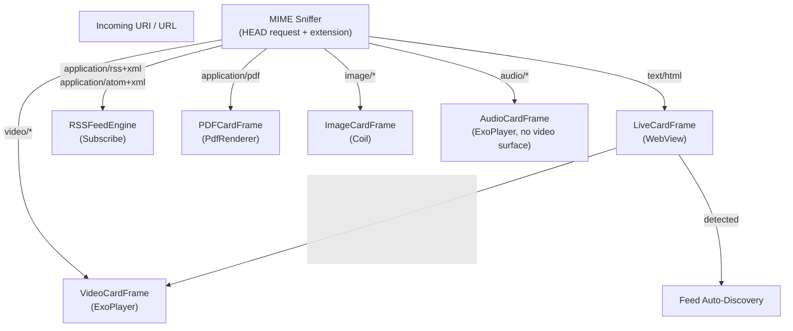

```kotlin
sealed class CardType {
    object Web : CardType()
    object Video : CardType()
    object Audio : CardType()
    object Article : CardType()    // RSS reader view
    object Image : CardType()
    object Pdf : CardType()
}

class ContentRouter @Inject constructor(
    private val httpClient: OkHttpClient
) {
    suspend fun resolve(uri: Uri): CardType {
        // 1. Check extension first (fast path)
        val extType = MimeTypeMap.getSingleton()
            .getMimeTypeFromExtension(uri.lastPathSegment?.substringAfterLast('.'))

        if (extType != null) return mapMimeToCardType(extType)

        // 2. HEAD request for Content-Type (slow path)
        val response = httpClient.newCall(
            Request.Builder().url(uri.toString()).head().build()
        ).await()

        val contentType = response.header("Content-Type") ?: "text/html"
        return mapMimeToCardType(contentType)
    }
}
```

---

## 4. Expanded Room Schema — Full ER Diagram

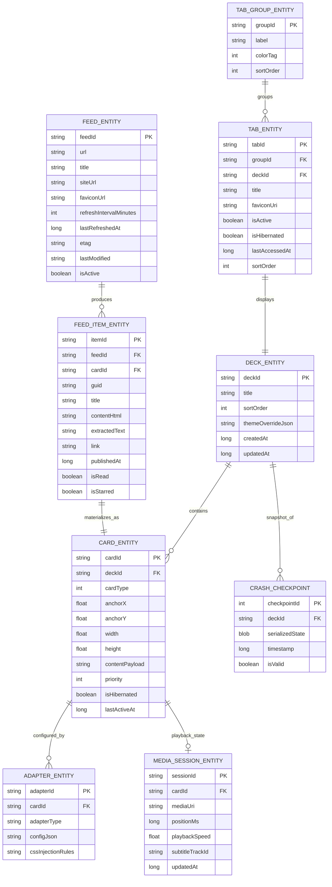

---

## 5. Media Pipeline — Complete Data Flow

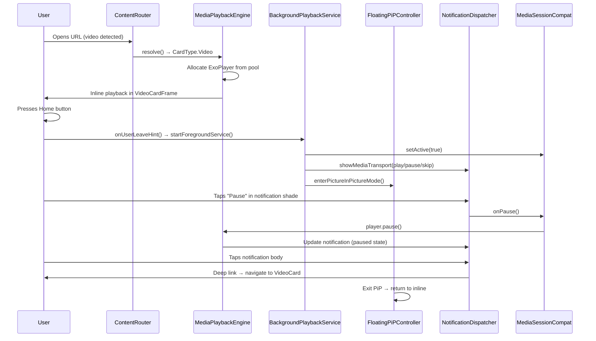

---

## 6. Updated Phased Implementation Roadmap (8 Phases)

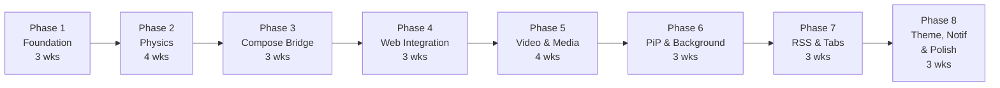

| Phase | Focus | Key Deliverables | Exit Criteria |
|---|---|---|---|
| **1: Foundation** | Data & DI | Room schema (all 8 entities), Hilt modules, MVVM scaffold, CrashRecoveryManager | Schema round-trips, DI compiles, crash restore works |
| **2: Physics** | QuadTree & Spring | QuadTreePhysicsEngine, SpringDynamicsProcessor, collision repulsion, sleep detection | 200 cards @ 60Hz ≤ 2ms per tick |
| **3: Compose Bridge** | GPU Integration | NodeSelectiveInvalidationState, DragDropGridCanvas, graphicsLayer hookup | 120fps sustained, zero parent recomposition from physics |
| **4: Web** | WebViews | LiveCardFrame, WebViewResourceGovernor, CSS normalization, snapshot scrim | 10 WebViews under RED threshold, hibernate/restore clean |
| **5: Video & Media** | ExoPlayer | MediaPlaybackEngine, ExoPlayerPool, adaptive streaming, subtitle renderer, ContentRouter | HLS/DASH playback, codec fallback, inline↔fullscreen transition |
| **6: PiP & Background** | Service Layer | FloatingPiPController, BackgroundPlaybackService, AudioFocusManager, BecomingNoisyReceiver | PiP enters/exits cleanly, audio survives app background, lock screen controls work |
| **7: RSS & Tabs** | Aggregation | RSSFeedEngine, FeedRefreshWorker, OPML import/export, TabDeckManager, TabStripRail | Feed refresh produces cards, tab switch < 300ms, tab hibernate works |
| **8: Polish** | Notifications & Theming | NotificationDispatcher (all channels), ThemeManager 3-level cascade, DeepLinkRouter, device benchmark matrix | Deep links resolve, theme propagates in 1 frame, all channels registered |

**Total estimated duration: ~26 weeks** (with parallel execution on Phases 5+6 and 7+8 cutting to ~20 weeks with full team)

---

## 7. Updated Engineering Team Dispatch Matrix

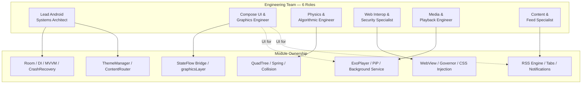

| Role | Phases | Core Responsibilities |
|---|---|---|
| **Lead Android Systems Architect** | 1, 8, oversight all | Room schema, Hilt DI, MVVM lifecycle, CrashRecovery, ContentRouter, ThemeManager, overall integration |
| **Compose UI & Graphics Engineer** | 3, 5 (UI), 7 (UI) | graphicsLayer, DragDropGridCanvas, VideoCardFrame surface, TabStripRail, gesture system |
| **Physics & Algorithmic Engineer** | 2 | QuadTree, spring dynamics, collision detection, sleep detection, spatial benchmarking |
| **Web Interop & Security Specialist** | 4 | WebView lifecycle, Governor state machine, JS/CSS injection, sandbox security |
| **Media & Playback Engineer** | 5, 6 | ExoPlayer integration, MediaSession, PiP API, BackgroundPlaybackService, audio focus, codec selection |
| **Content & Feed Specialist** | 7, 8 | RSS parser, WorkManager scheduling, OPML, NotificationDispatcher, DeepLinkRouter, feed-to-card factory |

---

## 8. Expanded Risk Register

| Risk | Severity | Mitigation |
|---|---|---|
| OEM kills foreground service (Xiaomi, Huawei, Samsung aggressive battery optimization) | **CRITICAL** | Detect OEM via `Build.MANUFACTURER`. Prompt user to whitelist app. Use `WakeLock` (partial) during active playback. |
| PiP not supported (API < 26, Android Go, some tablets) | **HIGH** | Feature-flag PiP behind `PackageManager.hasSystemFeature(FEATURE_PICTURE_IN_PICTURE)`. Fallback: background audio only. |
| ExoPlayer OOM with multiple HLS streams | **HIGH** | ExoPlayerPool hard cap at 3. `LoadControl` with reduced buffer: `setBufferDurationsMs(15_000, 30_000, 2_500, 5_000)`. |
| RSS feed returns malformed XML | **MEDIUM** | Use lenient XML parser (`XmlPullParser` with error recovery). Log and skip unparseable entries. Never crash on feed content. |
| WebView + ExoPlayer memory contention | **HIGH** | Governor coordinates with ExoPlayerPool. When video is active, lower WebView GREEN threshold from 60% to 45%. |
| Tab count explosion (100+ tabs) | **MEDIUM** | Soft limit at 50 tabs with user warning. Beyond 100, oldest hibernated tabs auto-close (with undo snackbar). |
| Notification permission denied (API 33+) | **MEDIUM** | `POST_NOTIFICATIONS` runtime permission request on first media play and first feed subscribe. Graceful degradation: no RSS alerts, media controls still work via `MediaSession`. |
| Codec not available on device | **LOW** | `MediaCodecList` queried at startup. Unsupported formats show "Format not supported" card overlay with download-and-convert option. |
| Feed refresh drains battery | **MEDIUM** | WorkManager constraints: `requiresBatteryNotLow(true)`, `requiresNetworkConnected(true)`. Minimum interval 15 minutes. Adaptive: feeds with no new content in 7 days → interval doubled. |

---

## 9. Updated Project File Structure

```
com.polymathdeck/
├── di/
│   ├── DatabaseModule.kt
│   ├── EngineModule.kt
│   ├── GovernorModule.kt
│   ├── ThemeModule.kt
│   ├── MediaModule.kt
│   └── NetworkModule.kt
├── data/
│   ├── db/
│   │   ├── PolymathDeckDatabase.kt
│   │   ├── entity/
│   │   │   ├── DeckEntity.kt
│   │   │   ├── CardEntity.kt
│   │   │   ├── AdapterEntity.kt
│   │   │   ├── TabGroupEntity.kt
│   │   │   ├── TabEntity.kt
│   │   │   ├── FeedEntity.kt
│   │   │   ├── FeedItemEntity.kt
│   │   │   └── MediaSessionEntity.kt
│   │   └── dao/
│   │       ├── DeckDao.kt
│   │       ├── CardDao.kt
│   │       ├── AdapterDao.kt
│   │       ├── TabDao.kt
│   │       ├── FeedDao.kt
│   │       ├── FeedItemDao.kt
│   │       └── MediaSessionDao.kt
│   └── repository/
│       ├── DeckRepository.kt
│       ├── FeedRepository.kt
│       └── MediaRepository.kt
├── engine/
│   ├── quadtree/
│   │   ├── QuadTreeNode.kt
│   │   ├── QuadTreePhysicsEngine.kt
│   │   └── BoundingBox.kt
│   ├── physics/
│   │   ├── SpringDynamicsProcessor.kt
│   │   ├── CollisionResolver.kt
│   │   └── NodeDelta.kt
│   ├── governor/
│   │   ├── WebViewResourceGovernor.kt
│   │   └── MemoryPressureMonitor.kt
│   ├── media/
│   │   ├── MediaPlaybackEngine.kt
│   │   ├── ExoPlayerPool.kt
│   │   ├── CodecSelector.kt
│   │   └── AdaptiveTrackSelector.kt
│   ├── feed/
│   │   ├── RSSFeedEngine.kt
│   │   ├── FeedParser.kt
│   │   ├── ContentExtractor.kt
│   │   ├── DeduplicationFilter.kt
│   │   ├── FeedCardFactory.kt
│   │   └── OPMLManager.kt
│   └── router/
│       └── ContentRouter.kt
├── bridge/
│   ├── NodeSelectiveInvalidationState.kt
│   ├── PhysicsToComposeDispatcher.kt
│   ├── MediaSessionState.kt
│   ├── FeedUpdateState.kt
│   └── TabDeckState.kt
├── service/
│   ├── BackgroundPlaybackService.kt
│   ├── AudioFocusManager.kt
│   ├── BecomingNoisyReceiver.kt
│   └── FeedRefreshWorker.kt
├── pip/
│   ├── FloatingPiPController.kt
│   └── PiPRemoteActions.kt
├── notification/
│   ├── NotificationDispatcher.kt
│   ├── NotificationChannels.kt
│   └── DeepLinkRouter.kt
├── ui/
│   ├── screen/
│   │   ├── DeckCanvasScreen.kt
│   │   └── FullscreenPlayerScreen.kt
│   ├── canvas/
│   │   ├── DragDropGridCanvas.kt
│   │   └── GestureController.kt
│   ├── card/
│   │   ├── SelectiveCardNodeContainer.kt
│   │   ├── LiveCardFrame.kt
│   │   ├── VideoCardFrame.kt
│   │   ├── ArticleCardFrame.kt
│   │   ├── AudioCardFrame.kt
│   │   ├── ImageCardFrame.kt
│   │   ├── StaticCardContent.kt
│   │   └── HibernationScrimOverlay.kt
│   ├── tab/
│   │   ├── TabStripRail.kt
│   │   ├── TabGroupChip.kt
│   │   └── TabContextMenu.kt
│   └── theme/
│       ├── ThemeManager.kt
│       ├── PolymathTheme.kt
│       └── ThemeChangeEvent.kt
├── recovery/
│   ├── CrashRecoveryManager.kt
│   └── CheckpointSerializer.kt
└── viewmodel/
    ├── DeckViewModel.kt
    ├── MediaViewModel.kt
    ├── FeedViewModel.kt
    └── TabViewModel.kt
```

---

## 10. Verification Gates (Updated for All 8 Phases)

| Gate | Tool | Pass Condition |
|---|---|---|
| **Compilation** | `./gradlew assembleDebug` | Zero errors |
| **Unit Tests** | `./gradlew testDebugUnitTest` | 100% pass on new tests |
| **Recomposition Audit** | Layout Inspector / Systrace | Physics → zero parent recompositions |
| **Memory Profile** | Profiler / LeakCanary | No leaks after 50 hibernate/restore cycles |
| **Frame Rate** | Macrobenchmark | ≥ 90fps with 50 cards |
| **Crash Recovery** | `adb shell am force-stop` | Restore < 2s |
| **Media Playback** | Manual + Automated | HLS/DASH stream → play/pause/seek/PiP/background all work |
| **PiP Transitions** | Manual on API 26+ | Inline → PiP → Fullscreen → PiP → Dismiss — zero player resets |
| **Background Audio** | Screen off test | Audio continues, lock screen controls respond, notification updates |
| **Feed Refresh** | WorkManager test driver | Conditional GET, dedup, card materialization, notification fired |
| **Tab Management** | Stress test | 50 tabs, switch < 300ms, hibernate/restore clean |
| **Notification Channels** | Settings inspection | All 4 channels registered, actions resolve to correct deep links |
| **OEM Battery Test** | Xiaomi/Samsung device | Foreground service survives 30min background with screen off |

---

> [!IMPORTANT]
> **Victory Condition:** This architecture is complete when all 8 phases pass verification gates on physical hardware, PiP/background playback survives OEM battery optimization on at least 3 manufacturer skins, RSS feeds refresh on schedule with zero crash on malformed XML, and the user explicitly confirms functional and performance satisfaction.
